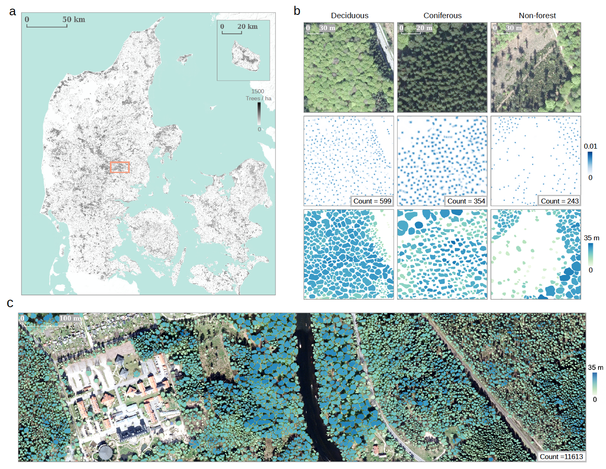

# Tree Counting, Crown Segmentation and Height Prediction at Scale

* This repo contains code for the paper [Deep learning enables image-based tree counting, crown segmentation and height prediction at national scale](https://academic.oup.com/pnasnexus/article/2/4/pgad076/7073732 'link to paper').

* See a followup tutorial for building a tree database using this project [here](https://github.com/sizhuoli/TreePointsStepbyStep).

## NEW!! Training and testing data released for research purposes


- Tree crown delineation data now available [here](https://sid.erda.dk/sharelink/eFt21tspNe)

- Please cite our paper if you find the data useful :)

- Acknowledgements to [Styrelsen for Dataforsyning og Infrastructur](https://sdfi.dk/) and [National Land Survey of Finland](https://www.maanmittauslaitos.fi/en/maps-and-spatial-data/) for open sourcing aeiral images for building the datasets
 
- P.S. A data corruption issue was spotted and fixed on 27/09/2024, please download the data again if you have downloaded it before this date!! The data is now stored in our university's data platform ERDA.

### Key features

For the Danish dataset:

- We offer image patches preprocessed in two ways: a. patch-normalization to 0 mean and unit std (used in paper); b. raw patches with orginial pixel intensities.

- There are several empty patches with no crown delineations (used as negative sample for training), which can be removed 

- Coordinates have been removed


## Trained models ready for deployment

### Download models: :crossed_fingers:

https://drive.google.com/file/d/1ZNibrh6pa4-cjXLawua6L96fOKS3uwbn/view?usp=sharing

Model names:

trees - date - time - optimizer - lr - input bnads - input shape - no. training tiles - segmentation loss - density loss - boundary weight (for separate individual trees) - model . h5 


### Working with Google Earth Engine :muscle:

https://github.com/google/earthengine-community/blob/master/guides/linked/Earth_Engine_TensorFlow_tree_counting_model.ipynb


### Working with local GPU machine :computer:

#### Set up conda environment

Depending on your GPU driver, you may try the following environment.yml files to set up the conda environment:

1. To set up the same environment:
```
conda env create -f environment_trees_updated.yml
```

2. If the above does not work, try the following to set up the basic environment and install the missing packages manually:


```
conda env create -f environment_trees_updated_basic.yml
```


#### Activate the environment

```
conda activate tf2151full
```

#### Run predictions

Get ready: 

1. Aerial images of arbitrary size, preferably with comparable spatial resolution as the training data (20 cm, otherwise may need downsampling or upsampling)

2. A proper model downloaded from the link above, or fine-tuned on local data. select a proper model based on the color bands

--- :bookmark: set configs ---

config/RasterAnalysis.py

```
python main4_large_scale_inference_transfer_other_data.py
```

Example prediction can be found in /example_1km_tile_tif/, where a model trained on RGB bands was applied to a 1 km x 1 km tile of aerial image captured in Denmark. You may reproduce the results by running step4_large_scale_inference_transfer_other_data.py with the provided configs (config/RasterAnalysis.py).


#### Tips for direct depolyment :sunglasses:	

- Standardize input image patches channel-wise -> ((image-mean)/std)

- For large image, predict with overlap (stride < patch width), take max prediction where overlap

- Upsample / Downsample to match the trained input resolution (20 cm)

- Finetune with small local annotation dataset


## Finetune / Train using local annotation data

### Prepare your own training data :see_no_evil:


Figure 0. Preparing your own tree crown annotation dataset. Delineate tree crowns inclusively within each selected annotating area.

#### Finetuning typically requires a small local annotation dataset (< 5 k tree crowns)


#### Run finetuning

Get ready: 

1. A proper model downloaded from the link above, matching the color bands of your local data
2. Your small local annotation dataset, prepared in the same structure as the Denmark/Finland dataset (downloadable with the link above). To convert from shapefile/geopackage to raster images, check main0_preprocessing.py
3. Recommended: the pretraining data (Denmark dataset), downloadable with the link above
4. A correct environment set up with the yml file

--- :bookmark: set configs ---
config/UNetTrainingFinetune.py


```
python main1-2_segcount_transfer_learning.py

```

-------------------------------------------------------------------------------------------------------

## Main training code:


### Preprocessing for tree crown segmentation and counting

Convert tree crown delineation data (in shapefile or geopackage format) to raster images for training

```
python main0_preprocessing.py
```

--- :bookmark: set configs ---

config/Preprocessing.py

-------------------------------------------------------------------------------------------------------

### Train 1st model from scratch: Tree crown segmentation & density counting:

```
python main1_multitask_counting_segmentation.py
```

--- :bookmark: set configs ---

case1: same input spatial resolution: use config/UNetTraining.py

case2: inputs of different spatial resolution (only support 1/2 coarser resolution for now): use config/UNetTraining_multires.py


--- :bookmark: example data for demonstration ---

example input data in: example_extracted_data/

:warning: IMPORTANT: LISCENCE REQUIRED FOR FORMAL USE OF THE DATA! 

--- :sparkles:	major tunable hyperparameters ---

- boundary weights: determine the penalty on crown boundaries for better individual separation

- task_ratio: the ratio for weighting the two losses to balance the emphasis on both tasks during training, may differ from case to case

- normalize: ratio to augment data by randomly normalizing image patches 

-------------------------------------------------------------------------------------------

### Train 2nd model from scratch: Tree height estimation from aerial images:

```
python main2_height_prediction.py
```

--- :bookmark: set configs ---

config/UNetTraining_CHM.py


-------------------------------------------------------------------------------------------

### Test 1st model (results in the paper): segmentation & counting:

```
python main3_predict_segmentation_counting.py
```

--- :bookmark: set configs ---

config/Model_compare_multires.py

--- :flags: Example prediction ---

See /example_extracted_data/

- segmentation result: seg_41.tif

- counting result: density_41.tif

:warning: Note that the model was trained using image patch no.41, and thus should not be tested using the same image in the test phrase. Here we simply demonstrate how to apply the model on a test image.


-----------------------------------------------------------------------------------------------

##


Figure 1. Overview of the framework used to count individual trees and predict their crown area and height. a, Deep learning-based framework for individual tree counting, crown segmentation, and height prediction. Spatial locations of individual trees are incorporated in the tree density maps and the crown segmentation maps. The canopy height map (CHM) derived from LiDAR data provides pixel-wise height information, which, when available for a specific study area, can optionally be used as an additional input band for the individual tree counting and crown segmentation tasks. b, Data preparation and modeling for tree counting and crown segmentation. The manually delineated individual tree crowns are modeled as density maps for the counting task by extracting the polygon centroids. The gaps between adjacent crowns are highlighted for the separation of individual tree crowns during the training phase. <br />

##


Figure 2. Example products from the proposed framework. a, Wall-to-wall tree count prediction for Denmark. b, Detailed examples showing the individual tree counting (second row), crown segmentation (third row), and height prediction (third row) from three major types of landscapes (deciduous forest, coniferous forest, and non-forest). c, Large-scale individual tree crown segmentation results colored by height predictions. Examples in b and c were sampled from the region indicated by the orange box in a.


